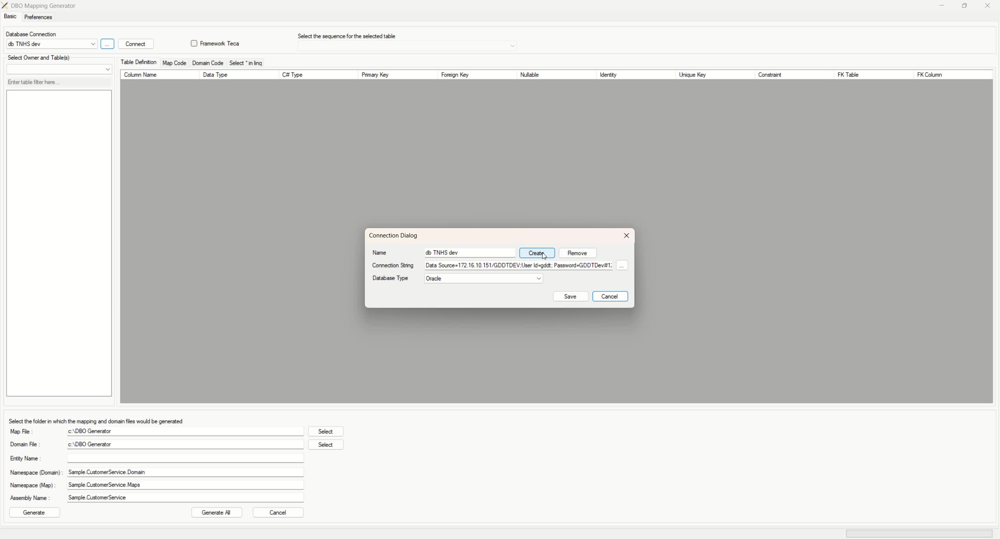
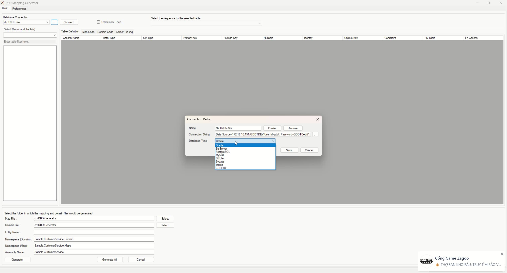
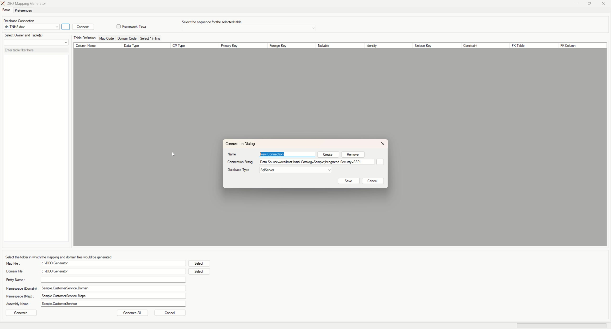
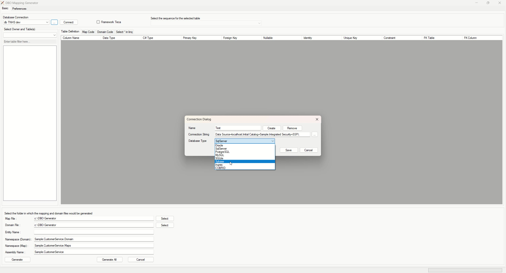
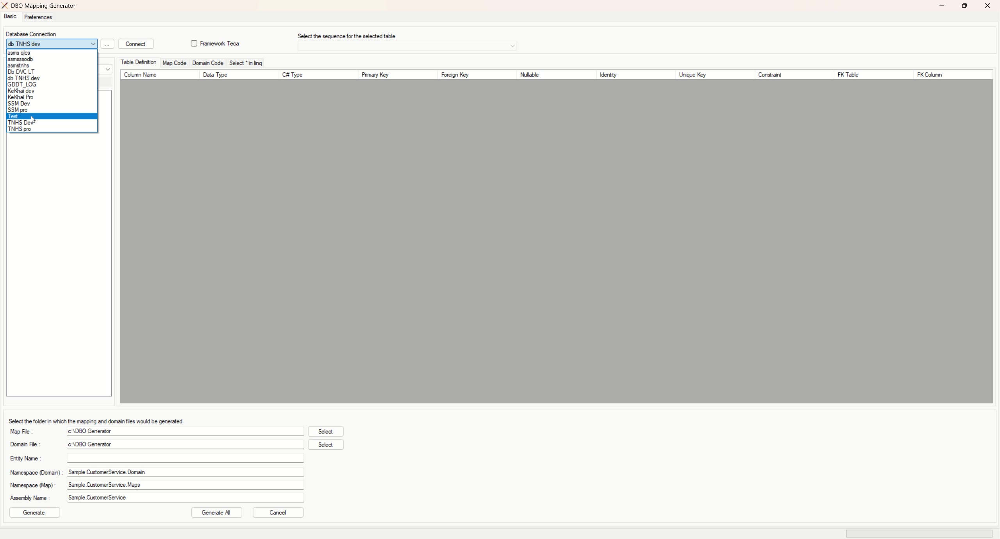
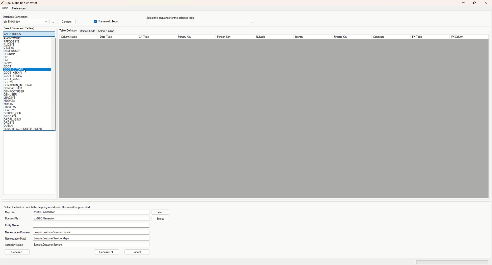
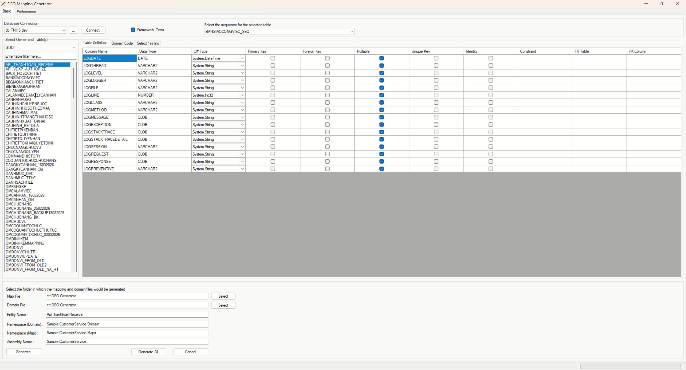
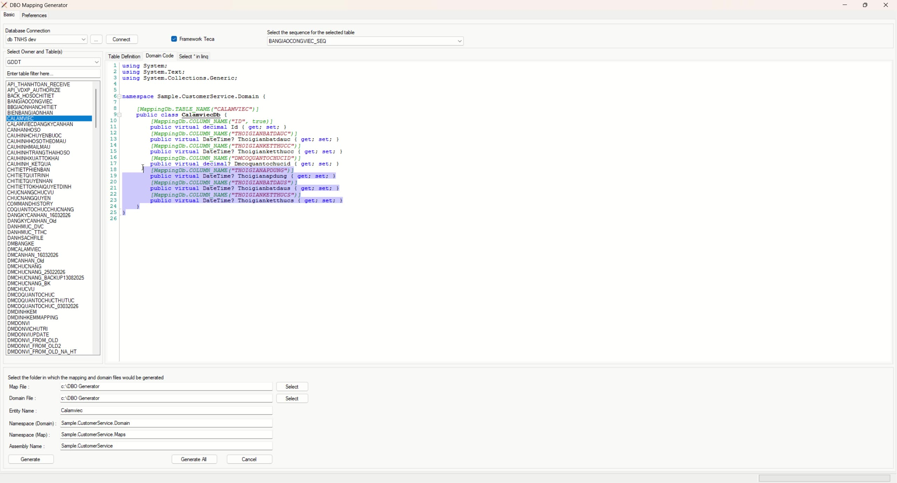

# Hướng dẫn sử dụng tool tạo class mapping table DB

Tài liệu này hướng dẫn dạng text kèm hình ảnh để sử dụng tool **DBO Mapping Generator**.

## Mục đích

Tool dùng để:

- kết nối tới database
- chọn owner/schema và table
- cấu hình thông tin mapping/domain
- sinh class entity mapping, domain code và đoạn `Select` dùng trong LINQ

---

## Quy trình tổng quát

1. Tạo hoặc chọn kết nối database.
2. Kết nối tới DB.
3. Chọn owner/schema.
4. Chọn table cần sinh mã.
5. Kiểm tra cấu trúc cột và metadata.
6. Khai báo thư mục output, entity name, namespace và assembly.
7. Sinh code.
8. Xem lại các tab `Table Definition`, `Domain Code`, `Select * in linq`.

---

## 1. Mở màn hình cấu hình kết nối

Tại màn hình chính, bấm nút `...` cạnh ô **Database Connection** để mở hộp thoại quản lý kết nối.



---

## 2. Chọn loại database

Trong hộp thoại **Connection Dialog**, chọn đúng loại database ở trường **Database Type**.

Video cho thấy tool hỗ trợ nhiều loại DB như:

- Oracle
- SqlServer
- PostgreSQL
- MySQL
- SQLite
- Sybase
- Ingres
- CUBRID



**Lưu ý:**
- Với Oracle, connection string thường theo dạng host/service hoặc SID.
- Với SQL Server, có thể dùng `Initial Catalog` và `Integrated Security` hoặc user/password tùy môi trường.

---

## 3. Tạo mới một connection

Có thể nhập tên kết nối tại ô **Name**, nhập **Connection String**, chọn **Database Type**, sau đó bấm `Create` để lưu.

Ví dụ trong video, người dùng tạo một connection cho **Oracle**.



Sau khi tạo xong, bấm `Save` để lưu cấu hình kết nối.

---

## 4. Chọn connection và kết nối tới DB

Quay lại màn hình chính, chọn connection trong danh sách **Database Connection** rồi bấm `Connect`.



Nếu kết nối thành công, bạn có thể tiếp tục chọn owner/schema và table.

---

## 5. Chọn owner/schema

Tại ô **Select Owner and Table(s)**, chọn owner/schema cần làm việc.

Trong video, thao tác chọn schema `GDDT` để lấy danh sách table thuộc schema đó.



Sau đó danh sách table ở khung bên trái sẽ được nạp để bạn tìm và chọn.

---

## 6. Chọn table và kiểm tra metadata cột

Chọn table ở danh sách bên trái. Sau khi chọn, tab **Table Definition** sẽ hiển thị cấu trúc cột và các thông tin mapping.

Các cột thông tin chính gồm:

- **Column Name**: tên cột trong DB
- **Data Type**: kiểu dữ liệu DB
- **C# Type**: kiểu dữ liệu C# sinh ra
- **Primary Key**
- **Foreign Key**
- **Nullable**
- **Unique Key**
- **Identity**
- **Constraint**
- **FK Table / FK Column**

Ngoài ra phía trên còn có tùy chọn:

- **Framework Teca**
- **Select the sequence for the selected table**



**Lưu ý khi rà soát bước này:**
- kiểm tra `C# Type` có map đúng với kiểu DB không
- đánh dấu đúng các cột khóa chính, khóa ngoại, nullable
- nếu table dùng sequence thì chọn đúng sequence tương ứng

---

## 7. Cấu hình thông tin output và namespace

Ở phần bên dưới màn hình, khai báo các thông tin đầu ra:

- **Map File**: thư mục sinh file mapping
- **Domain File**: thư mục sinh file domain/entity
- **Entity Name**: tên class sinh ra
- **Namespace (Domain)**
- **Namespace (Map)**
- **Assembly Name**

Sau đó có thể bấm `Generate` để sinh cho table hiện tại hoặc `Generate All` nếu tool hỗ trợ sinh hàng loạt theo lựa chọn.

---

## 8. Xem trước mã sinh ở tab Domain Code

Tab **Domain Code** cho phép xem trước class domain/entity được sinh ra.

Trong video, tool sinh class có mapping attribute như:

- `[MappingDb.TABLE_NAME("...")]`
- `[MappingDb.COLUMN_NAME("...")]`

và property C# tương ứng với các cột trong bảng.



Điều này giúp kiểm tra nhanh:

- tên class
- tên property
- attribute mapping table/cột
- kiểu dữ liệu C# sau khi map

---

## 9. Xem trước đoạn Select dùng trong LINQ

Tab **Select * in linq** sinh sẵn đoạn projection để dùng trong truy vấn LINQ, ví dụ dạng:

```csharp
new
{
    h.Id,
    h.Thoigianbatdauc,
    h.Thoigianketthucc,
    h.Dmcoquantochucid,
    h.Thoigianapdungc,
    h.Thoigianbatdaus,
    h.Thoigianketthucs
}
```



Tab này hữu ích khi cần copy nhanh danh sách cột sang câu truy vấn LINQ.

---

## 10. Kết quả đầu ra mong đợi

Sau khi sinh code, thông thường bạn sẽ nhận được:

- file class domain/entity cho table
- file mapping class
- đoạn code hỗ trợ select trong LINQ

Tùy cấu hình của project, các file này sẽ được đưa vào đúng namespace và assembly đã khai báo.

---

## Khuyến nghị sử dụng

- Đặt quy ước tên `Entity Name`, `Namespace (Domain)`, `Namespace (Map)` thống nhất trước khi sinh code.
- Kiểm tra lại `C# Type` với các cột `NUMBER`, `DATE`, `TIMESTAMP`, `CLOB`, `VARCHAR2` để tránh sai kiểu.
- Với Oracle, nên rà lại sequence trước khi generate nếu bảng dùng sequence để insert.
- Sau khi sinh code, vẫn nên review lại file output trước khi commit.

---

## Tóm tắt thao tác nhanh

```text
Mở tool
→ Chọn / tạo connection
→ Connect
→ Chọn owner/schema
→ Chọn table
→ Rà metadata cột
→ Khai báo output + namespace
→ Generate
→ Kiểm tra Domain Code và Select in LINQ
```

---
